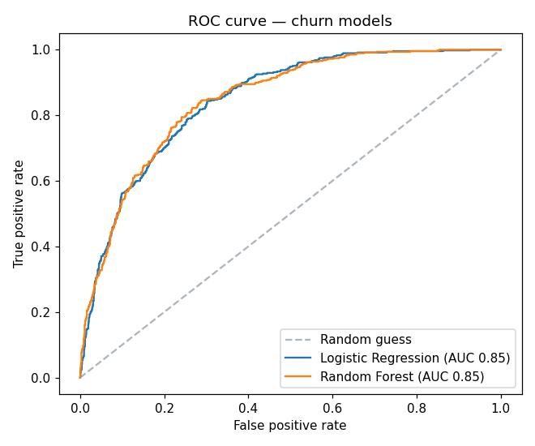
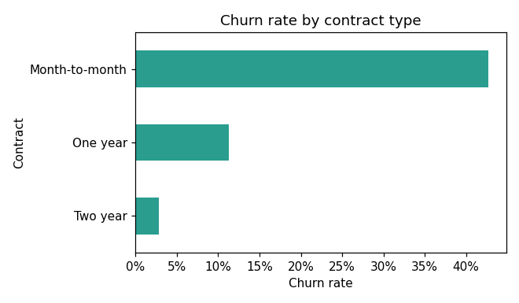
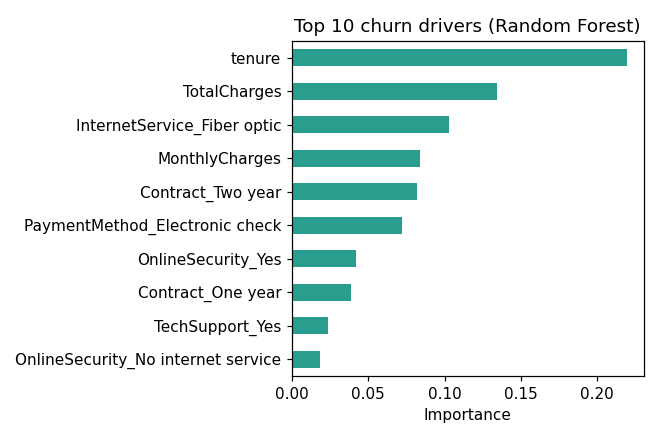
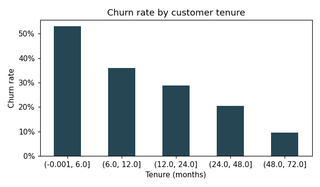

# Customer Churn Prediction

Predicting which telecom customers are about to cancel — so the business can
step in before they leave. An end-to-end supervised machine-learning project in
Python: data cleaning, exploratory analysis, model training, evaluation, and
interpretation.

**Result:** a model that identifies churners with a **ROC-AUC of 0.85**, plus
clear, actionable insight into *why* customers leave.

---

## Problem

Acquiring a new customer costs far more than keeping an existing one, yet most
businesses only discover a customer has left *after* it happens. The goal here
is to flag at-risk customers early, using the behavioural and account data a
telecom already has.

## Dataset

[IBM Telco Customer Churn](https://www.kaggle.com/datasets/blastchar/telco-customer-churn)
— 7,043 customers, 20 features (contract type, tenure, monthly charges, services
subscribed, payment method, etc.) and a binary `Churn` label. Overall churn
rate: **26.5%** (an imbalanced target, handled below).

## Approach

1. **Cleaning** — converted `TotalCharges` from text to numeric and handled the
   blank values that appear for brand-new customers.
2. **Exploratory analysis** — quantified churn across contract types, tenure,
   and services to understand the drivers before modelling.
3. **Preprocessing** — one-hot encoded categorical features; standardised inputs
   for the linear model.
4. **Modelling** — trained two models and compared them:
   - **Logistic Regression** (a strong, interpretable baseline, with
     `class_weight="balanced"` to handle the imbalanced target)
   - **Random Forest** (a non-linear ensemble)
5. **Evaluation** — measured on a held-out 25% test set using ROC-AUC,
   precision, and recall (accuracy alone is misleading on imbalanced data).

## Results

| Model | ROC-AUC | Accuracy | Churn recall |
|-------|:-------:|:--------:|:------------:|
| Logistic Regression | 0.846 | 0.75 | **0.80** |
| Random Forest | 0.847 | 0.80 | 0.47 |

Both models reach ~0.85 AUC. The choice between them is a **business trade-off**,
not just an accuracy number: the balanced Logistic Regression catches **80% of
churners** (higher recall — better when the cost of missing a leaver is high),
while the Random Forest is more precise but misses more. For a retention team
that wants to catch as many at-risk customers as possible, the recall-focused
model is the better tool.



## Key findings (the "why")



- **Contract type is the single biggest lever.** Month-to-month customers churn
  at **42.7%**, versus **11.3%** on one-year and just **2.8%** on two-year
  contracts. Moving customers onto longer contracts is the highest-impact
  retention play.
- **New customers are the most fragile** — churn is highest in the first year of
  tenure and falls steadily after.
- **Fibre-optic internet, high monthly charges, and paying by electronic check**
  all correlate with higher churn — pointing at price sensitivity and a specific
  payment-behaviour segment worth investigating.




## Tech

Python · pandas · scikit-learn · matplotlib

## Run it

```bash
pip install -r requirements.txt
python churn_analysis.py
```

Metrics print to the console; charts are written to `images/`.
